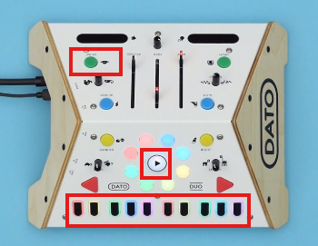

# 🥁 **Umpa Bumpa Trommel**

*Erobere die Melodie der Wolken!*

------------------------------------------------------------------------

## 🌩️ **Die Legende beginnt...**

Es war einmal, in einem Land fernab der Wolken, wo die Menschen der Erde
noch **On-premise** lebten.\
Sie sehnten sich danach, hinaufzusteigen in das Reich der Wolken.

Doch **die böse CloudIA**, Herrscherin der Schatten im Himmel, stellte
sich ihnen entgegen.\
Mit dunkler Magie belegte sie das Land in ein tiefes Schweigen.

Nur **du**, Träger der inneren Musik, besitzt die Macht, diesen Bann zu
brechen.\
Finde den wahren Rhythmus, erwecke die Melodie -- und nur dann wird die
Magie der CloudIA zerbrechen...\
und der Weg zu den Wolken wird sich öffnen.

------------------------------------------------------------------------

# ⭐ **Installation & Start des Spiels**

Das Spiel **Umpa Bumpa Trommel** ist in Python entwickelt und benötigt:

-   `numpy`
-   `pygame`
-   ein **DATO DUO** über USB

------------------------------------------------------------------------

## 🧭 **Schritt 1 -- Projekt vorbereiten**

### 📁 **Repository klonen**

Erstelle zuerst ein neues Verzeichnis:

``` bash
mkdir WolkenMelodie
cd WolkenMelodie
```

Dann klone dieses Projekt:

``` bash
git clone https://github.com/wilberquiroz/umpa-bumpa-trommel.git
```

### 🧪 **Virtuelle Umgebung aktivieren**

Erstelle und aktiviere ein virtuelles Python-Environment:

**Linux/macOS:**

``` bash
python3 -m venv venv
source venv/bin/activate
```

**Windows:**

``` bash
python -m venv venv
venv\Scripts\activate
```

### 📦 **Abhängigkeiten installieren**

``` bash
pip install -r requirements.txt
```

------------------------------------------------------------------------

## 🔌 **Schritt 2 -- DATO DUO verbinden**

1.  Verbinde das **DATO DUO** via USB mit deinem Computer.\

2.  Starte das Spiel. Benutz am liebsten den ganzen Pfad, z.B:

    ``` bash
    C:\\Users\\wcar\\Desktop\\WolkenMelodie\\.venv\\Scripts\\python.exe c:/Users/wcar/Desktop/WolkenMelodie/core/main.py
    ```

Die Spiel-Fenster öffnet sich -- doch *kehre zurück zur Konsole!*\
Dort wirst du nach den **MIDI-Geräten** gefragt:

-   **Input:** DATO DUO Input (meistens Option **#1**)\
-   **Output:** Microsoft GS Wavetable Synth (meistens Option **#2**)

------------------------------------------------------------------------

# 🎮 **Wie wird gespielt?**

Dieses Bild  zeigt die Steuerungen, die du zum Spielen benötigst.  
Oben links befindet sich der **Crush-Button**…  
Unten findest du die **Melodie- und Sequenz-Regler**.

------------------------------------------------------------------------

## 🥁 **Phase 1 -- Der Rhythmus der Wolken**

Nutze den **Crush-Button** des DATO DUO.

Deine Aufgabe:\
👉 **Antizipiere den Schlag des Gegenspielers.**

Es ist ein **Rhythmusspiel**:\
Je näher du dem *wahren Rhythmus* kommst, desto mehr verwandeln sich die
Schläge in **musikalische Noten**.

-   Überwinde die **erste Wolke**:\
    Dann erscheinen zwei weitere Wolken -- jede mit einem eigenen
    Rhythmus.
-   Hast du eine Wolke gemeistert, bleibt dein Rhythmus bestehen\
    und wird fortlaufend gespielt -- er dient dir als **Leitfaden** für
    die nächsten Wolken.

------------------------------------------------------------------------

## 🎨 **Phase 2 -- Die Melodie der Farben**

Sobald deine rhythmische Basis stabil ist, erscheint sie vor dir:\
👉 **die Klang-Schlüsselmelodie**.

Nutze die **Melodie-Kontrollen** des DATO DUO, um:

1.  Die **Farbenfolge** auf dem Bildschirm nachzubauen.\
2.  Mit dem **Play-Button** die Sequenz abzuspielen.

Nun kommt die wahre Prüfung:

🎯 **Passe die Melodie an den Rhythmus an!**

Drehe den Geschwindigkeitsregler (**Schildkröte -- Hase**)\
bis Rhythmus und Melodie **perfekt verschmelzen**...

✨ *Nur dann brichst du den Bann der CloudIA!*

## 🌟 **Phase 3 – Das freie Spiel der Wolkenmelodie**

Nachdem du den Bann der CloudIA gebrochen hast, liegt das Reich der Wolken offen vor dir.  
Nun beginnt das wahre Abenteuer!

Spiele mit den anderen Knöpfen und Reglern des DATO DUO, experimentiere mit neuen Klängen,  
verforme die Melodie, erweitere deinen Rhythmus und entdecke, welche musikalischen  
Möglichkeiten in den Wolken verborgen sind.

✨ **Lass deiner Kreativität freien Lauf – die Melodie gehört jetzt dir!**

------------------------------------------------------------------------

# 🌈 \*\*Viel Mut, Musiker\*in!\*\*

Möge dein Rhythmus klar bleiben und deine Melodie die Wolken erleuchten.
